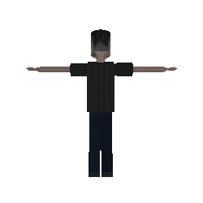

# 👋 Olá, eu sou o Diego

### 🛠️ Stack de Tecnologias

- 🐍 **Python** — Django, Flask
- 🗄️ **SQLite** — banco de dados leve
- ⚙️ **C++** — programação de sistemas
- 🐧 **Linux** — ambiente principal
- 💻 **Bash** — automação e scripts
- 🟨 **JavaScript** — frontend e Node.js
- 🟩 **Node.js** — runtime backend
- 🌐 **HTML5** — estrutura web
- 🎨 **CSS3** — estilização
- 🎮 **Godot** — desenvolvimento de jogos
- 🔧 **Git** — controle de versão
- 🌙 **Lua** — scripting e embeds

